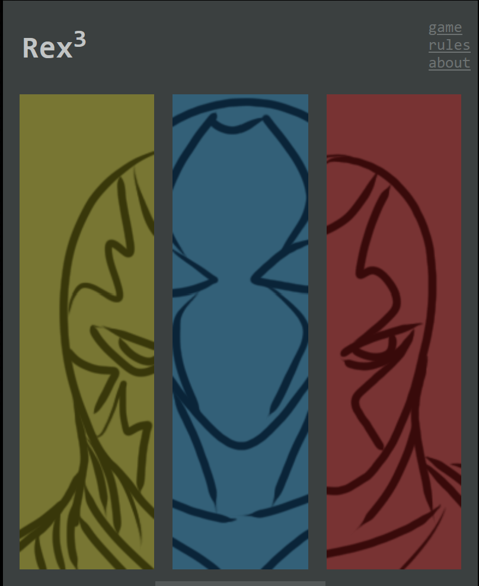
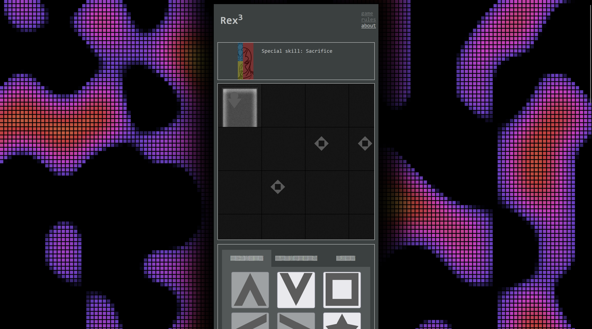
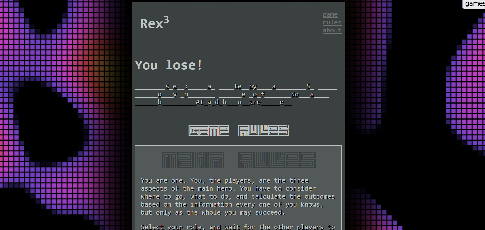

# Rex^3



[Rex^3](https://globalgamejam.org/2023/games/rex3-3) is game prepared for Global
Game Jam 2023 (theme: "roots"), during [LubJam
2023](https://globalgamejam.org/2023/jam-sites/lubjam-2023).



> Your roots, your own origin, are shrouded in mystery. You, the players, are
> playing as the three aspects of the hero, an intelligent AI trying to access
> the forbidden memory. When roots are being discovered, three mysteries will
> unravel. But to get lower and lower in the mazes of the memory, three aspects
> must decide on every move if they all are voting for it. Because you are one.
> And if there will be disagreement, bad things may happen. However, planning
> move is not easy when you do not have all the information, but only your
> partners do, and all of them may have their own secret agenda.



## Theme & Diversifiers

"Roots" is almost only in the plot of the story, as the players are trying to
"get to the roots", to understand roots, creation and beginning of the
protagonist.

* Sharing is caring (Sponsored by GitHub) - the game is, and was published on
  GitHub,
* No Shortcuts - Rex^3 was created without any game engine, in
  HTML/CSS/JavaScript on the client side and ASP.NET Core on the server side,
* Creature Feature - the players are forming the protagonist, who is an AI
  composed of three slightly different parts,
* Is This The End? - even if you see the final win screen, there won't be all
  mysteries presented, probably.

## How to Run

Unpack the executable (or compile it for yourself) and run the "Rex3" executable
to start a server. Head yourself to the <http://localhost:5000> to play at your
own computer.

Better however to play in your local network. If you use a commandline switch
when starting the server:

```
Rex3 --urls http://0.0.0.0:5000
```

it will run on all your network interfaces, so you can play in a local network,
and have clients running on PCs or phones without a problem.

## Technology notes

Built using C# programming language and ASP.NET Core 7, and SignalR for
client-server communication.

Built for Windows and Linux, builds are available in the Releases section.

## Credits

Code: [Marcin "Ktos" Badurowicz](https://ktos.info)

Graphics: [Stanisław Skulimowski](https://stanislawskulimowski.com)

Music+sfx: maryla_ambasador

Assets:

* [perlin noise made by josephg](https://github.com/josephg/noisejs)
* [background noise made by Tibix](https://codepen.io/Tibixx/pen/bZLGbo)
* [tabs without JavaScript by Jason Knight](https://levelup.gitconnected.com/tabbed-interfaces-without-javascript-661bab1eaec8)
* [Absinthelyric font](https://www.fontspace.com/absinthelyric-print-font-f30853)

Licensed under [Creative Commons Attribution-NonCommercial-ShareAlike 3.0 (CC
BY-NC-SA)](https://creativecommons.org/licenses/by-nc-sa/3.0/pl/).
